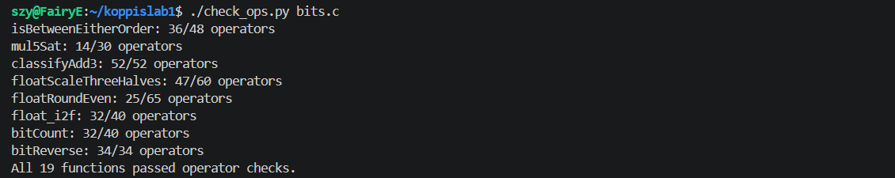
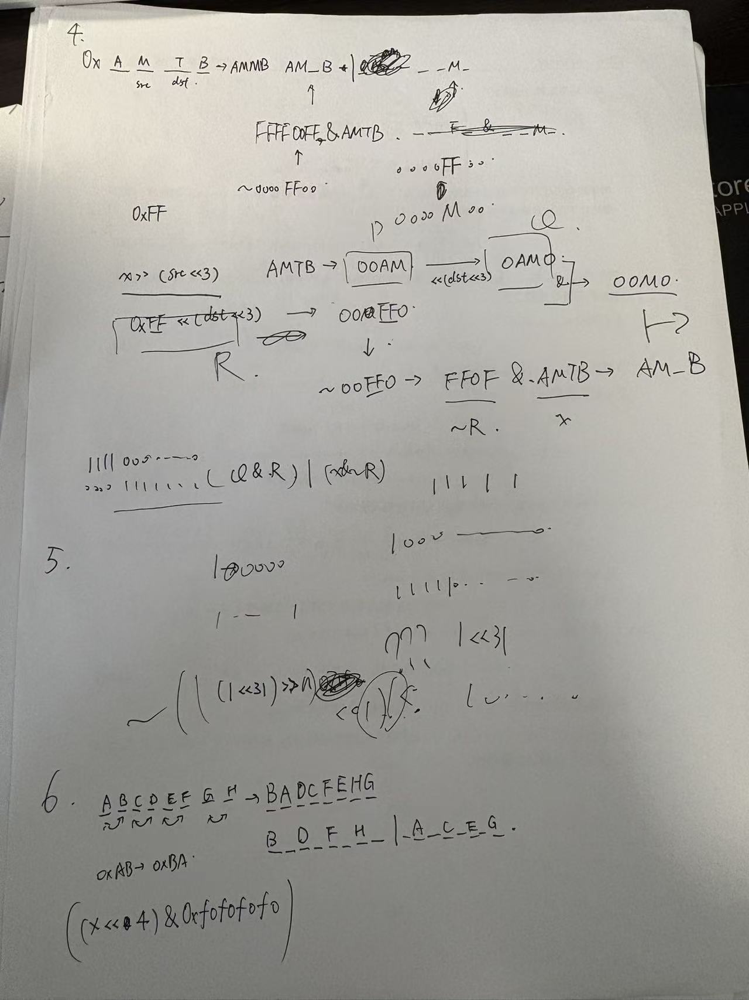
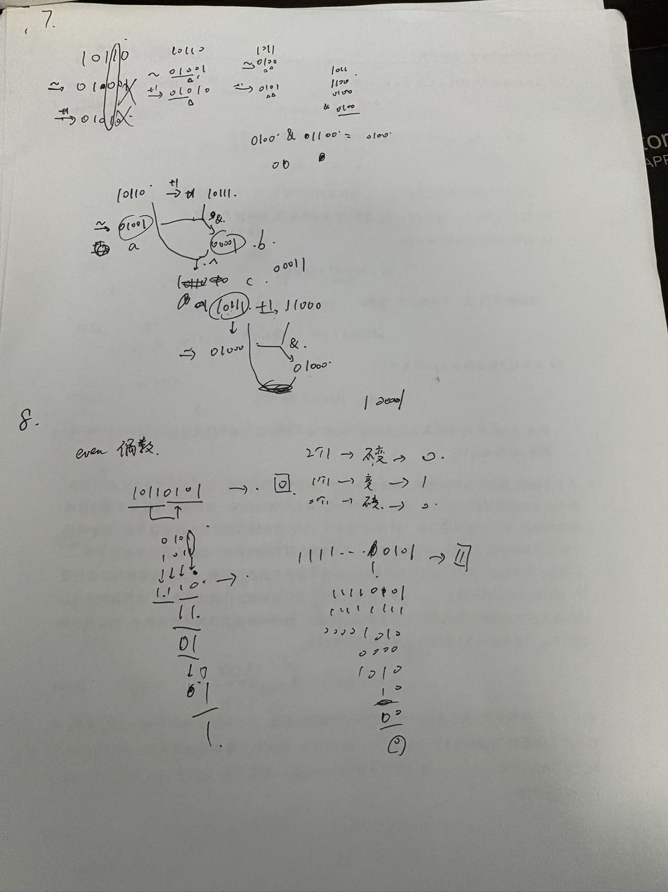
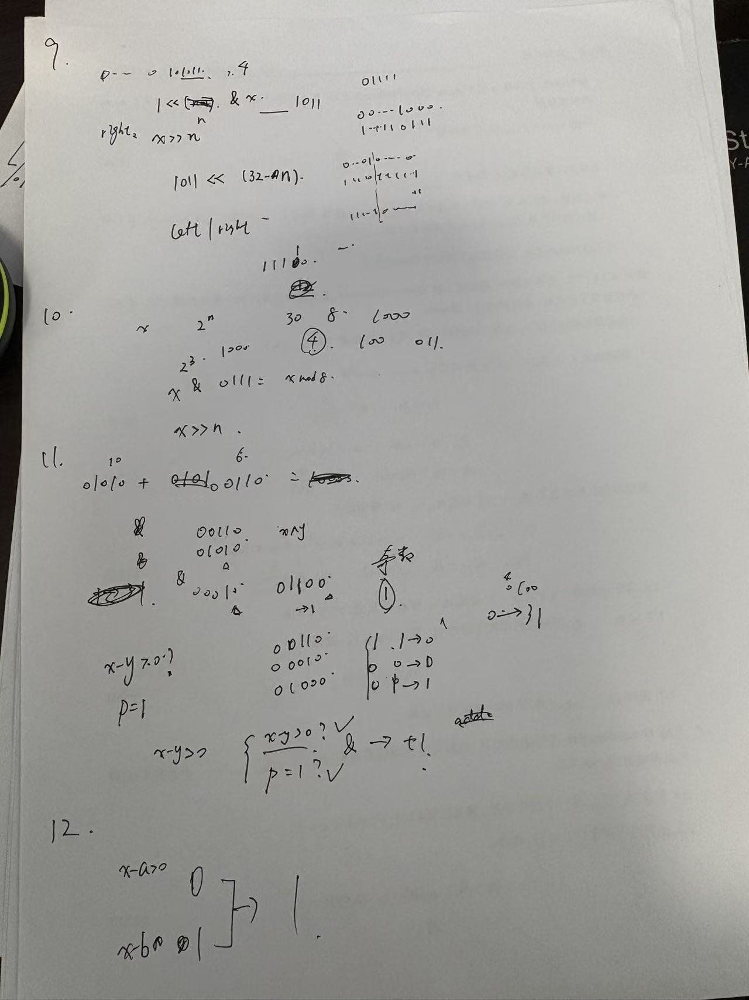

lab1实验报告

施泽宇 25300180032

P1

0x80000000是‌binary1后面31个0，然后就是1左移31位就可以了

P2

用&和~表示异或

分别取反和另一个原数做位与运算，再把得到的两个结果取反再做位与，再把得到的结果取反

P3

负数输出相反数，正数输出0

想到原数右移31位就是32个符号位的数字，然后正数可以直接输出0；负数输出全为1；

然后一个数的相反数可以用-x=~x+1来计算。然后就把这个结果和前面得到的结果做位与运算。

正数因为全是0所以位与得到的结果也全是0；负数全是一所以位与得到的结果就是-x本身。

P4

分成了4个块从左到右是3210，那么要先取出被复制的那一块（src）：

比如说是2，那么就要把所有其他部分全部消除掉，那就是相当于右移16个单位（src*8），在这里就表示成src<<3，然后再让x执行右移

同样的方法可以让刚才得到的那个部分移到他应该去的位置也就是左移dst*8个单位。

最终我希望得到的运算是 x除掉被修改的那部分|被修改的那部分其他全是0，于是我就需要一个掩码

把0xff左移dst*8个单位（记作Q）再做位与运算就可以得到其他部分全是0的被修改的那部分；

对Q取反与x做位与运算就可以得到除去被修改的那部分的x，再把两个东西做或运算就可以了。

P5

首先是考虑到只右移nbit就是相当于除了2^n，但是计算机在右移过程中会给负数自动补位1而不是0，于是就要考虑做一个掩码把这些1消除。

这个掩码的前n位都要是0，后面位置都是1；所以先考虑0x80000000向右移动n然后取反，然后向左把原来那个1移出，把位置对齐就可以了

最后就是前两者做位或运算

P6

移到对应的位置用0xf0f0f0f0和0x0f0f0f0f分别取掩码再合起来就可以

用左移0xf创造相应的掩码

P7

找到第二个0之前一定要找到第一个0，然后把它变成1：

直接加1的话变化的最高的那一位就是0的位置

比如10101的第一个0就是第1位，直接加1可以获得10110；而取反可以得到01010，两者做位与运算可以得到00010

这时候再做异或运算就可以把第一个0变成1，得到了一个新的数字

按照刚刚那个例子就是10111，然后重复一次这个运算就可以了

P8

两个0或者两个1其实都不会影响最终的结果，只有1个0和1个1会影响最终的结果

于是可以用异或运算比较一个数字的前16位和后16位得到一个新数

然后再比较新数的后16位的前8位和后8位，以此类推

最后由于偶数是要输出1的，但是异或运算里的偶数输出为0，所以给最终结果保留最后一位再取反

P9

把结果分成原数左移和原数右移两个部分拼起来

左移的部分就是rotate回去的部分，利用掩码保留相应的bit，然后因为不让右移左移32位所以就先移动t再移动1防止n=0时候一次移动32位的情况

右移部分同理，创造一个00…（n个bit）…011…（32-n个bit）…1的掩码与右移后的x组合即可

P10

这个函数要把非负整数 x舍入到最近的 2^n 的倍数，如果正好在中点，则选择商为偶数的那个倍数

先找到相应的2的n次方代表的数（记为s）

找到s的一半记作half，用于判断数字离哪里更近

用 p=s-1作为低 n位的掩码，r=x&p求出x除以2^n的余数。

用q1=!(r ^ half) 判断 r 是否正好等于 half，即 x 是否恰好在两个倍数的中点。

用q=x>>n得到x/s的商，q2=q&1取商的奇偶。panduan=q1&!q2 表示x在中点且商为偶数。

如果 panduan=1，就说明了x在中点且而且商为偶数，应该向下取整到当前商，所以 add=0；否则 add=half

最后 (x + add) & (~p) 将低的n位变成0，得到结果

P11

这个函数要算 (x+y)/2 假如结果正好在两个整数之间时，选择靠近x 的那个数。

原本的考虑是（x+y）>>1但是想到x+y可能会直接导致数值溢出所以就换个idea

搜索得到了公式 x+y = (x&y)+(x|y)=2*(x&y)+(x^y)，这样算m=a+(o>>1) 就得到了向下取整的中点，而且不会溢出。

p=o&1用异或表示表示x+y 的奇偶性，如果为1，说明x+y的最后一位不一致，就是奇数，然后需要决定向上取整还是向下取整。

接下来要判断x是否大于等于y。由于直接相减可能溢出，所以分同号和异号两种情况。signx = x >> 31，signy = y >> 31，sa = ~(signx ^ signy) 表示同号时为全 1，异号时为全 0。同号时，x - y 不会溢出，用 jian=x+(~y + 1) 计算差值，s=~(jian >> 31) 在 x >= y 时为全 1；异号时，x>=y说明 x 非负，用 t = ~signx 表示。最后 add = (sa & s) | (~sa & t) 综合两种情况，得到x >= y的判断（全 1说明真）。

如果中点在两个整数之间（p = 1）且 x >= y，则应该向上取整，即 m + 1；否则向下取整，返回 m。所以最终返回 m + (p & add)。

P12 

这个函数判断 x 是否在 a 和 b 构成的闭区间内，端点顺序任意。

一开始我想到的还是直接用x-a和x-b的符号位做异或运算得到最后的结果，写的很简单远远小于步数，但是还是因为溢出的可能性所以失败了

于是还是按照刚才判断相加减的方法，先取各数的符号位：sx=x>>31，sa=a>>31，sb=b>>31。计算 x - a和x - b。

判断x是否>=a ：如果 x 和 a 异号（sx ^ sa 非零），那么 x >= a 等价于 x 非负，即 ~sx 为全 1；如果同号，则 x-a 不会溢出，x>=a 等价于 xa>=0，于是~(xa >> 31) 为全 1。把这两种情况用掩码组合起来，得到 xcompwa。同理可得到acompwx，xcompwb和bcompwx。

然后 x 在 a 和 b 之间或者b与a之间。用 !!(comp1 | comp2) 得到结果

P13

这个函数计算 x * 5，如果溢出则显示INT_MAX或INT_MIN。

首先取 x 的符号位 r=x>>31，r 为 0 表示 x >= 0，为-1表示 x < 0。

正溢出判断：不溢出的最大值是 0x19999999。计算t=x-0x19999999，如果 x > 0x19999999，则t>0，t>>31为0，~ (t >> 31) 为全 1。用 Ap = ~r&osignt 表示是否有正溢出的情况：当 x >= 0 且 t > 0 时 Ap 才为全 1。同理可以做出Mp。

计算5x。最后用掩码选择：无溢出时返回5x，正溢出时返回 0x7fffffff，负溢出时返回 0x80000000利用类似if的语句做筛选，即（p & ~Ap & ~Mp) | (0x7fffffff & Ap) | (0x80000000 & Mp)

P14 

这个函数判断三个整数 x + y + z 的精确数学和是否超出 int 范围，超出则返回 1 或 -1，否则返回 0。

由于三个数相加可能中间溢出，但最终和可能回到正常范围也有可能溢出。用add1= x+y 得到低 32 位，用 sx = x >> 31 等得到各数的符号。计算 x + y 的无符号进位 s1：(((x & y) | ((x | y) & ~add1)) >> 31)&1。然后h1= sx+sy+s1就是x+y的高 32 位。

接着用相同的方法得到x+y+z的高32位和低32位；分别判断它们是否满足相应的溢出条件，正溢出h2大于等于0且add2非负；负溢出小于等于-1且add2非负。最后转化为0/1进行输出。

P15 

首先拆出 s（符号）、e（指数）、f（尾数）。

e == 0xFF 表示 NaN 或 Inf，直接返回原值；e == 0 且 f == 0 表示 ±0，也直接返回。

如果 e == 0，是非规格化数，实际尾数 m = f，实际指数 E = -126；否则是规格化数，m = (1 << 23) | f，E = e - 127。

计算 n = m * 3，因为乘以 1.5 就是乘以 3 再除以 2。

找 n 的最高位位置 p，右移位数 sh = p - 23，使最高位落在第 23 位。

若 sh <= 0，说明结果太小，仍是非规格化数。值等于 n * 2^(E-24) = (n/2) * 2^(E-23)，所以对 n/2 做 round-to-nearest-even进位后若达到 2^23，就变成最小的规格化数 1.0*2^-126；若 sh > 0，把 n 右移 sh 位，根据移出的部分做 round-to-nearest-even。若舍入后变成 2^24，再右移一位并让 sh 增 1。新的指数字段 en = E + sh - 1 + 127，若 en >= 255 则返回无穷大。最后拼回符号、指数、尾数。

这个题其实写到一半的时候感觉不太会让ai帮助了一下，思路上应该差不多。

P16

拆出 s、e、f。e == 0xFF 返回原值；e == 0 是非规格化数或零，绝对值小于 1，舍入到带符号零，返回 s，实际指数 ex = e - 127。

如果 ex >= 23，浮点数本身已经是整数，直接返回原值。

然后根据 ex 是否为 -1 以及尾数是否为零，决定舍入到 0 还是 ±1

若 0 <= ex < 23，构造 24 位尾数 m = (1 << 23) | f。右移位数 sh = 23 - ex，整数部分 ip = m >> sh，小数部分 fp = m & ((1 << sh) - 1)，一半 h = 1 << (sh - 1)。

用 round-to-nearest-even 判断是否进位，若 ip == 0，返回带符号零。

否则把整数 ip 规格化为浮点数：找最高位位置 p，指数 en = p + 127，尾数 fn = (ip << (23 - p)) & 0x7FFFFF

P17

这个函数把整数 x 转换为单精度浮点数的位表示。

若 x == 0 直接返回 0。取符号位 s = x & 0x80000000，再取绝对值 ux。对 INT_MIN，-x 在无符号意义下仍是 0x80000000，表示 2^31，所以正确。

找到 ux 的最高位位置 p，指数字段 exp = p + 127。

若 p <= 23，尾数位足够，直接 frac = (ux << (23 - p)) & 0x7FFFFF。

若 p > 23，需要右移 shift = p - 23 位并做 round-to-nearest-even。右移得到 M，移出部分 rem，一半 half = 1 << (shift - 1)。若 rem > half 或 rem == half 且 M 为奇数，则 M++。若 M 变成 2^24，再右移一位并让 exp++。尾数 frac = M & 0x7FFFFF。

最后检查 exp >= 255，是则返回无穷大，否则拼回符号、指数、尾数

P18

这个函数统计 32 位整数中 1 的个数

把每 2 位中的两个位分别取出相加，得到每 2 位中 1 的个数。第二步合并每 2 位得到每 4 位计数。依次用更大掩码合并，最终得到整个 32 位中 1 的总数。

P19

这个函数反转 32 位整数的所有位

和第18题类似，构造相同的掩码，然后先相邻两位交换，再4位，再8位，再16位，就可以得到最终结果

就是需要把步数卡在34，这个好难。

一些草稿（有点乱不过）

